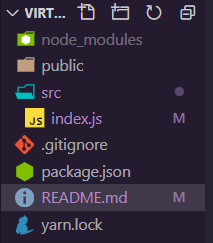

本项目旨在理清React源码, 及几个核心 API 的思想

1. 项目拉起

```bash
npx create-react-app tiny-react
cd tiny-react
npm start
```

2. 将目录简化如下:



3. 简单的React 和 ReactDOM的实现：

   1. React.createElement()为jsx实现的核心接口，具体见下图：

      

   2. src\index.js 文件改写如下:

      ```jsx
      import React from './yreact/';
      import ReactDOM from './yreact/ReactDOM';
      
      const jsx = <div className="border">app</div>
      ReactDOM.render(jsx, document.getElementById('root'));
      ```

   3. 创建 `src\yreact\index.js` 作为React主文件

      ```jsx
      //! node -- dom节点
      //! vnode -- 虚拟dom节点
      
      // 接收type,props,children, 返回一个vnode
      const createElement = (type, props) => {
        // 把__source和__self属性删去，方便阅读
        delete props.__source
        delete props.__self
        
        return { type, props }
      }
      export default { createElement }
      ```

   4. 创建 `src\yreact\ReactDOM.js` 作为`ReactDOM.render()` 接口使用：

       ```jsx
      const render = (vnode, container) => console.log('vnode', vnode)
      export default { render }
      ```

      可以看到控制台：

      

   5. 这里还没处理children，可以继续对 createElement 进行改写, 加上`...children` , 把原来的jsx也改一下：

      ```jsx
      - const createElement = (type, props) => {
      + const createElement = (type, props, ...children) => {
        ......
      
- return { type, props }
      + return { type, props: { ...props, children } }
      ```
      
      ```jsx
      - const jsx = <div className="border">app</div>
          
      + const jsx = <div className="border">
      +   <p>text</p>
+   <a href="#">hehe</a>
      + </div>
```
      
      控制台显示：
      
      

以上的`["text"]` 和 `["hehe"]`并不能算完整，文本节点也须转换为对象才可，继续改造`createElement ` 方法：

```js
props: {
    ...props,
    // 把children放到新的props上：
    // 假如为文本节点，则将其创建为一个对象，利用creatTextNode()函数：
    children: children.map( child => typeof child==='object'? child : creatTextNode(child) )
}
```

在yreact/index.js文件里创建新的函数`creatTextNode` :

```js
const creatTextNode = text => ({
  type: 'TEXT',
  props: {
    children: [],
    nodeValue: text
  }
})
```

控制台则显示：


6. 完善yreact/ReactDOM.js, 把虚拟node变回真实node的过程：

   ```js
   const render = (vnode, container) => {
     console.log('vnode', vnode)
     // vnode -> node
     const node = createNode(vnode)
     // 把node放入container
     container.appendChild(node)
   }
   
   // 根据vnode, 创建一个node
   const createNode = vnode => {
     const {type, props} = vnode
     let node;
     if (type === 'TEXT') {
       node = document.createTextNode('')
     }else{
       node = document.createElement(type)
     }
     return node
   }
   export default {
     render
   }
   ```

   可以看见页面#root节点下增加了一个div：

   

   

这里只实现了一层的结构，必须在 `createNode`  里增加一个递归函数处理children `reconcilerChildren` 实现:

```js
const createNode = vnode => {
  ... ...
  // 递归循环children的元素：
  + reconcilerChildren(vnode)    
}

+ const reconcilerChildren = (children, node) => {
+  for (let i = 0; i < children.length; i ++ ) {
+    render( children[i], node )
+  }
+ }

  return node
}
```

页面`#root div` 下就添加进p和a标签了：

 

控制台递归打印出DOM结构：


处理完以上，再处理节点上的属性，如className, herf等等

```js
// 更新节点上的属性， 如className,  nodeValue等
const updateNode = (node, nextVal) => {
  Object.keys(nextVal)
  .filter( k => k !== 'children' )
  .forEach( k => node[k] = nextVal[k] )
}
```

```js
const createNode = vnode => {
  ... ...
  + reconcilerChildren(props.children, node)
  ... ...
}
```

页面：


